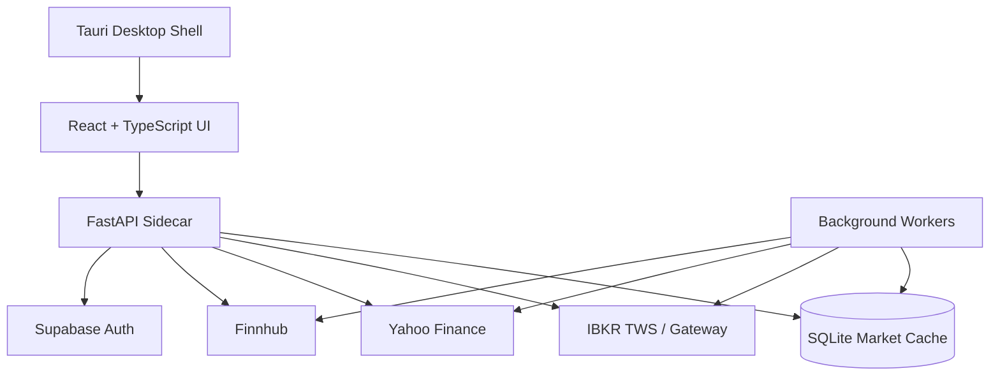

<div align="center">

<picture>
  <source media="(prefers-color-scheme: dark)" srcset="public/dailyiq-brand-resources/daily-iq-topbar-logo.svg">
  <source media="(prefers-color-scheme: light)" srcset="public/dailyiq-brand-resources/daily-iq-topbar-logo-black.svg">
  
</picture>

**Desktop trading research workspace for users with live watchlists, technical scoring, options analytics, historical caching, and a modular Tauri-based UI.**


</div>

---


---

## Platform at a Glance

| Coverage | API Surface | Chart Engine | App Model |
|:---:|:---:|:---:|:---:|
| **850 enabled equities** | **30 FastAPI endpoints** | **41 indicators / strategies** | **Tauri desktop + Python sidecar** |

---

## What This Project Is

DailyIQ is a desktop-first market research and trading workspace built around IBKR connectivity (along with backups). The application combines a React/TypeScript frontend, a Tauri desktop shell, and a FastAPI sidecar backed by local SQLite storage.

It is designed to give traders a fast local workspace for:

- live watchlists and quote monitoring
- historical charting and indicator analysis
- technical scoring across multiple timeframes
- options chain inspection with computed Greeks
- portfolio review for both IBKR and manual accounts
- sector heatmaps and screener workflows

---

## System Architecture



---

## Core Features

### Modular desktop workspace

- Multi-tab workspace with dedicated views for Dashboard, Charting, Heatmap, Screener, Options Analysis, and additional in-progress research tabs.
- Drag-resizable dashboard layout with lock/unlock controls for stable trading layouts.
- Link channels let components share symbol context across quote cards, watchlists, charts, portfolio panels, and mini heatmaps.
- Workspace state persists locally and can be exported/imported as `.diq` workspace files.
- Tauri window controls, native desktop packaging, and built-in app update support.

### Live data with layered fallbacks

- Primary market data path is Interactive Brokers TWS / Gateway.
- Watchlist and active symbol management use lease-style tracking so the backend only keeps relevant symbols warm.
- When IBKR is unavailable, the app can fall back to Yahoo Finance and optionally Finnhub depending on market session and configuration.
- Market snapshots are written into SQLite so the UI can keep rendering from cached state even when live connectivity degrades.
- Background loops also maintain broader universe snapshots for heatmap and screener views.

### Watchlists and market monitoring

- Persistent watchlist storage in SQLite.
- Quote cards and watchlist panels show last, bid, ask, spread, percent move, volume, and valuation fields.
- Watchlist rows can include technical score columns across multiple timeframes.
- Custom watchlist columns support indicator values, score rules, crossovers, and expression-based logic.
- Diagnostics endpoints exist for watchlist health and quote status inspection.

### Professional charting engine

- Custom chart engine implemented in TypeScript rather than wrapping a hosted chart dependency.
- Supports candlestick, line, area, bar, Heikin-Ashi, and volume-weighted views.
- Includes pan/zoom, crosshair, tooltip, sub-panes, indicator legends, and detached indicator pane workflows.
- Historical bars are cached locally in SQLite across intraday and daily tables.
- Chart data can come from live IBKR flow or local cached history populated through the sidecar workers.

### Technical analysis and scoring

- Technical scoring pipeline computes normalized 0-100 scores for `5m`, `15m`, `1h`, `4h`, `1d`, and `1w`.
- Backend scoring is built on pandas/numpy over locally cached OHLCV data.
- The chart engine exposes 41 registered indicators and strategies, including overlays, oscillators, volume studies, technical score views, and signal strategies.
- The screener and heatmap surface cached daily/weekly scores, while watchlist-centric views can pull intraday horizons as well.

### Options analytics

- Options chain worker fetches chains from Yahoo Finance and stores both contract metadata and point-in-time snapshots.
- Black-Scholes Greeks are computed locally for delta, gamma, theta, vega, and rho.
- The options UI groups expirations by month and displays calls and puts side-by-side by strike.
- Stored chain rows include bid, ask, mid, IV, volume, open interest, intrinsic value, extrinsic value, and expiration context.
- Symbol prioritization favors manual portfolio holdings and watchlist symbols before optional broader-universe collection.

### Portfolio workflows

- Native portfolio view supports connected IBKR accounts.
- Manual portfolio manager supports local accounts, positions, cash balances, and grouping.
- Portfolio tables can be sorted and customized, and can mix price fields with technical score columns.
- Position views are designed to work even when the user is not actively connected to IBKR by relying on cached quotes and manual account data.

### Heatmap and screener research views

- S&P 500-style heatmap layout sized by market cap and grouped by sector.
- Hover detail panels expose price move, sector, industry, valuation, and technical score context.
- Screener view supports search, symbol drill-in, market-cap sorting, valuation sorting, technical timeframe toggles, and verdict labels.
- Filters include watchlist, MAG 7, movers, bullish, and bearish sets.

### Authentication and local-first storage

- Desktop sign-in supports Google OAuth via Supabase.
- Session persistence uses local storage on device.
- Market cache, workspace state, and operational data are stored locally in SQLite and app-managed files.

---

## Data Model

The backend persists application state in local SQLite tables, including:

- `watchlist_symbols`, `watchlist_quotes`, and `watchlist_status`
- `market_snapshots` and `active_symbols`
- `technical_scores`
- `ohlcv_5s`, `ohlcv_1m`, `ohlcv_1d`, plus bid/ask historical variants
- `option_contracts`, `option_snapshots`, and `option_chain_fetch_meta`
- manual portfolio accounts, positions, cash balances, and groups

This design keeps the UI responsive, reduces repeated external fetches, and allows the desktop app to continue working from cached state when upstream providers are slow or temporarily unavailable.

---

## API Overview

The FastAPI sidecar exposes 30 REST endpoints covering:

- health and provider status
- Finnhub validation
- IBKR and manual portfolio operations
- watchlist read/write flows
- quotes and market snapshots
- S&P 500 heatmap data
- options summary and option chain retrieval
- active-symbol registration
- technical scores and indicator reads
- historical bar delivery

Representative routes include:

- `GET /health`
- `GET /portfolio`
- `GET /watchlist`
- `GET /quotes`
- `GET /market/snapshots`
- `GET /heatmap/sp500`
- `GET /options/summary`
- `GET /options/chain`
- `GET /technicals/scores`
- `GET /historical`

---

## Tech Stack

| Layer | Technologies |
|---|---|
| **Desktop Shell** | Tauri 1 |
| **Frontend** | React 18, TypeScript 5, Vite, React Router |
| **Backend** | Python 3.11-3.12, FastAPI, Uvicorn |
| **Data / Analytics** | pandas, numpy, scipy |
| **Broker / Market Data** | Interactive Brokers, Yahoo Finance, Finnhub |
| **Database** | SQLite |
| **Auth** | Supabase OAuth |

---

## Repository Structure

```text
src/         React frontend, pages, hooks, dashboard components, chart engine
src-tauri/   Tauri shell, native bootstrap, updater, bundling config
backend/     FastAPI sidecar, data workers, SQLite helpers, regression tests
data/        Static ticker metadata and local runtime settings
public/      Brand assets and symbol logos
```

---

## Getting Started

### Prerequisites

- Node.js 18+
- Python 3.12 recommended
- Interactive Brokers TWS or IB Gateway for live broker connectivity
- Optional: Finnhub API key
- Supabase project credentials for desktop authentication (not required for .exe download)

### Install

```bash
npm install
```

For backend setup, the repo includes an automated bootstrap script:

```bash
npm run setup:backend
```

That script installs `uv`, provisions Python 3.12, creates `backend/.venv`, and installs backend dependencies.

### Run the frontend

```bash
npm run dev
```

### Run the desktop app

```bash
npm run tauri dev
```

### Run the FastAPI sidecar directly

```bash
python3 backend/main.py --port 18100
```

### Run background workers directly

```bash
python3 backend/worker_watchlist.py
python3 backend/worker_options.py
```

---

## Validation

Frontend:

```bash
npm run build
```

Backend syntax check:

```bash
python3 -m py_compile backend/main.py backend/worker_watchlist.py backend/db_utils.py
```

Backend regression tests live under `backend/tests/`.

---
